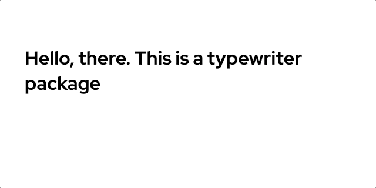
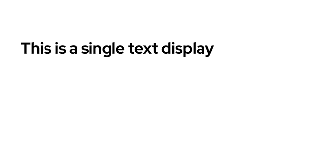

# React-typewriter-effect

A package that gives your text a typing effect

### Use case scenario

## Description

This package lets you create a typewriting effect for text elements



- Typewriter Effect animates when component is in view. By default it uses the document reference to check if component is in view or not. But you can pass the ref object which is scrollable to the scollArea props.

**For example**

```
const myRef = document.querySelector('.scrollable-div')

<TypeWriterEffect width="230" trackWidth="13" percentage={score} scrollArea={myRef} />
```

**Otherwise**
if scrollArea is not defined, document reference object is used.

## Set up

To use package, Start by installing package

- npm i react-typewriter-effect

**on your react project file**

### For a single text display

```
import TypeWriterEffect from 'react-typewriter-effect';

 <TypeWriterEffect
            textStyle={{ fontFamily: 'Red Hat Display' }}
            startDelay={100}
            cursorColor="black"
            text="This is a single text"
            typeSpeed={100}
            scrollArea={myAppRef}
          />

```

#### Output



### For a multiiple text display

Set the muultiText props to an array of strings which are displayed sequentially

```
import TypeWriterEffect from 'react-typewriter-effect';

     <TypeWriterEffect
        textStyle={{
          fontFamily: 'Red Hat Display',
          color: '#3F3D56',
          fontWeight: 500,
          fontSize: '1.5em',
        }}
        startDelay={2000}
        cursorColor="#3F3D56"
        multiText={[
          'Hey there, This is a type writer animation package',
          'it consist of two types...',
          'Single text display and multi text display',
          'Fonts can be customized.',
          'The type speed can be customized as well',
        ]}
        multiTextDelay={1000}
        typeSpeed={30}
      />
```

#### Output


## Properties and description

- text (must be a string): Required in sigle text display mode. The text in string.

- multiText (array of string): Required in multi text mode.

- multiTextDelay (must be a number): delay before each text is erased in multi text display in milliseconds.

- multiTextLoop creates a continous loop of the typewriter text (true/false).

- typeSpeed (must be a number): Speed of typing in milliseconds.

- startDelay (must be a number): Delay before animation starts in milliseconds.

- hideCursorAfterText (a boolean): it removes cursor after typing.

- cursorColor (must be a string): color of the cursor.

- elementType (a string or a React component): the element/component that will be wrapped around the typewriter-effect text.  Defaults to H1.

- textStyle (must be an object): custom css styles can be applied to the text in this object.

- scrollArea (must be a dom element): the scrollable area. By default it is the document.

